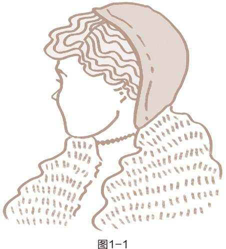
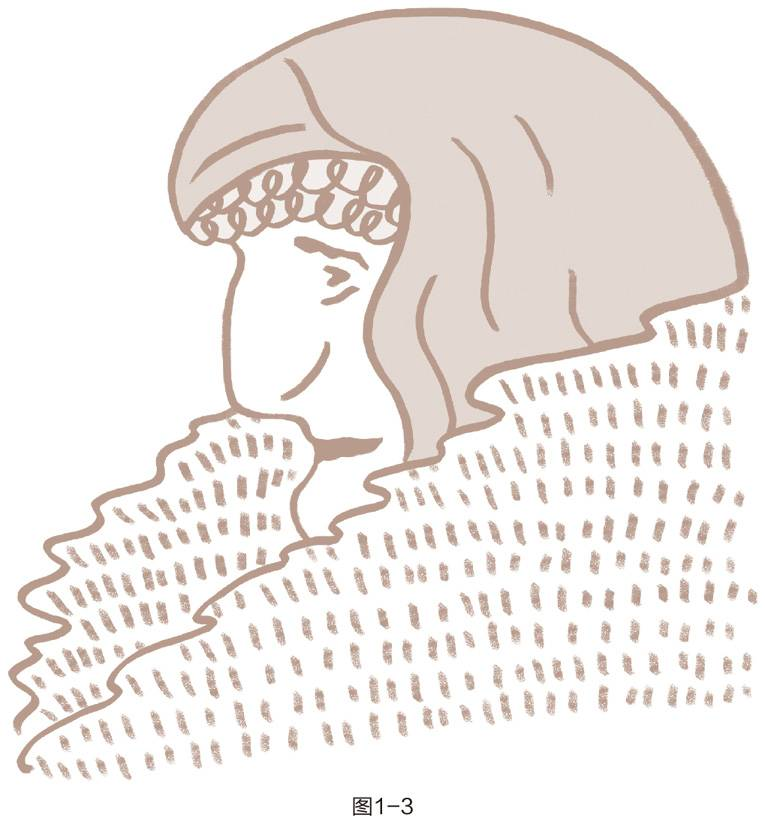
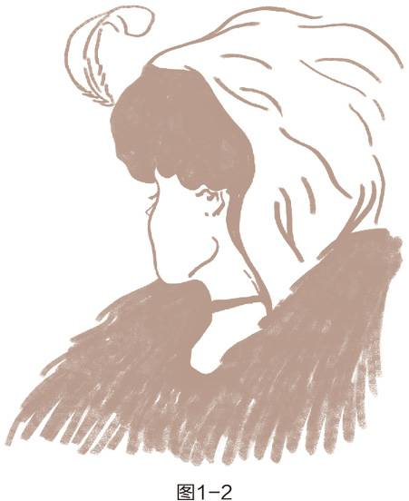

“每个人的思维方式都是那么根深蒂固，仅仅研究世界是不够的，还要研究我们看世界时所戴的“透镜”，因为这透镜（即思维方式）往往左右着我们对世界的看法。”

## 品德与个人魅力孰重

作者研究近 200 多年来的成功因素：

- 品德成功论 Character ethics。勇敢正直的品德，可以让你成功。

- 个人魅力论 Personality ethic。第 1 次世界大战后，认为成功取决于性格，社会形象，行为态度，人际关系，社交技巧。

## 光有技巧还不够

个人魅力占次要，品德才是最重要的东西。

日久见人心，长期相处最重要的底牌是真诚。

品德才是交流中最伶俐的口齿。品德有余却沟通技巧不足的人，即便人际关系质量因此受到影响，也是瑕不掩瑜。

## 思维方式的力量

地域是真实存在的一个地方，地图是地域的一个抽象映射。

可以把地图看作我们的思维，如果我们拿着错的地图，那我们就会到达一个错的地方。我们可以更加努力一点，但这样只是更快的到达错误的地方。

两类地图

- 反映真实情况的物理世界的地图。

- 反映个人价值观的思维方式地图。

哈佛商学院的一个感知实验：

教授在课堂上发放两叠卡片，分别下图中的1-1少妇像和1-3老妇像，让他们看10秒钟之后，然后收回。

然后再给他们投影看结合两者特点的1-3，让他们去描述这幅图像。

结果很多看过少妇像的人认为他是少妇，看过老妇像的人认为他是老妇。

这个实验说明了几点。

- 条件作用影响人类认知和思维方式。

- 思维方式是人类行为和态度的源头。

- 这个实验还反映了个人魅力论的基本缺陷：仅仅改变表面的行为和态度，却没有改变作为源头的品德，最终的成效一定是很有限的。

- 在人际关系中，很多时候更多是立场决定观点，即使别人差异的观点也是清晰和客观的。

## 思维转换的力量

思维转化 paradigm shift

科学研究的每一项重大发现都是在打破传统打破旧思维：

## 身体力行

思维方式之所以如此强大是因为构成我们观察世界的窗口。

## 以原则为中心的思维方式

品德成功论的一个基本信念：人类效能都需要原则作为指引。

这里说的原则是一些普遍认可的原则，比如

- 公平

- 平等与正义

- 诚信与正直

原则和实践的区别：原则是普适性的，通用性的。实践是特定性的。比如父母教育第1个孩子的方式不能套用在第2个孩子身上。

如何抓住原则的本质？可以用取反的方式：没有人认为可以靠欺骗，隐瞒，伪装，偷盗，抢劫的方式，过上一个持久长期幸福美满的生活。

正确的思维方式比努力改变行为和态度更能提高我们个人和人际关系的效能。

在关系比较紧张的时候，教导会被视为一种批评和攻击。但是在关系比较融洽的时候，教导才能够真正的被吸进去。比如母亲和儿子在生气的时候，母亲对儿子的教导，在儿子看来都是一种批判和否定，但是在睡前和早起比较缓和的时候，母亲对儿子的教导才是循序渐进的有效果。

## 症结在于治标不治本

寻求快速提升的方法或捷径，其实都是治标不治本，甚至会加剧源头的问题。

比如说我们看到一个全家孩子都考上清华的人，东施效颦模仿他们家庭的教育方式，但是却不去改善家庭关系间的效能。

套路可以带来一时的利益，但是套路是不可持续的。

本书的一个基本点以原则为中心，以品德为基础，要求“由内而外”地实现个人效能和人际效能。

“由内而外”是说，先改变自己，进而才能改变人际，反之则不行。

“由外而内”：比如夫妻有矛盾的时候，他们会通过揭露对方的恶语，来判定问题的根源在对方的身上，只要对方改变，整个婚姻就那变得圆满。

## 新的思想水平

爱因斯坦(Albert Einstein)曾说：“重大问题发生时，依我们当时的思想水平往往无法解决。”

由内而外的观点认为个人领域的成功先于公共领域的成功。

测试自己的效能：

（一）检验你的思维方式

你曾经到过其他国家或本国其他地区吗？你觉得哪些事情是陌生的或奇怪的？

人们的行为是否如你预期？你对他们的行为有何看法？

回想你的旅游经历，你认为当地人对你的看法如何？你是否认为他们对你的看法与你对他们的看法可能很类似？

如果你有机会在旅途中认识当地人，你对他们的看法或推测会有什么改变？

（二）转换你的思维方式

回想一下通往你的工作场所或你家的不同路径。是否有些路径比其他的更复杂？是否有时其中一条比其他的更方便？为什么方便，为什么不方便？

你是否发现过一条你以前不知道的新路径？走不同路径的新鲜感如何？

现在想一下你与他人打交道的方式。与他们打交道是否有好几种方式？你还有可能会尝试哪些新的方式？

（三）影响你生活的五个原则

请列出影响你的日常生活的五个原则。它们以怎样的方式影响你？它们是以积极的还是消极的方式影响你的生活？

1. 

2. 

3. 

4. 

5. 

