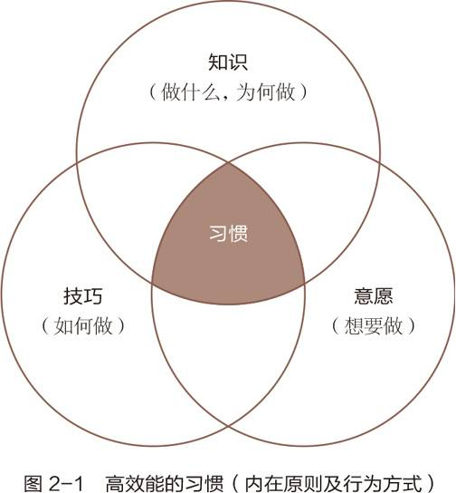
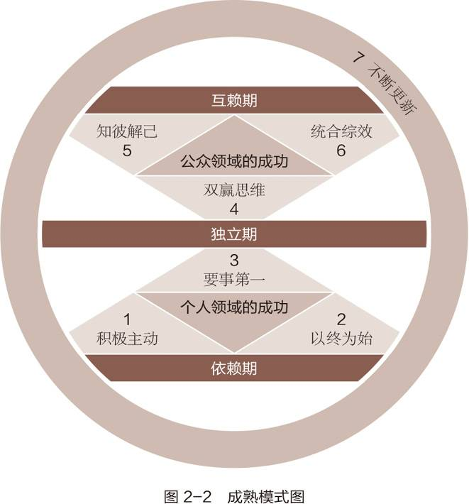
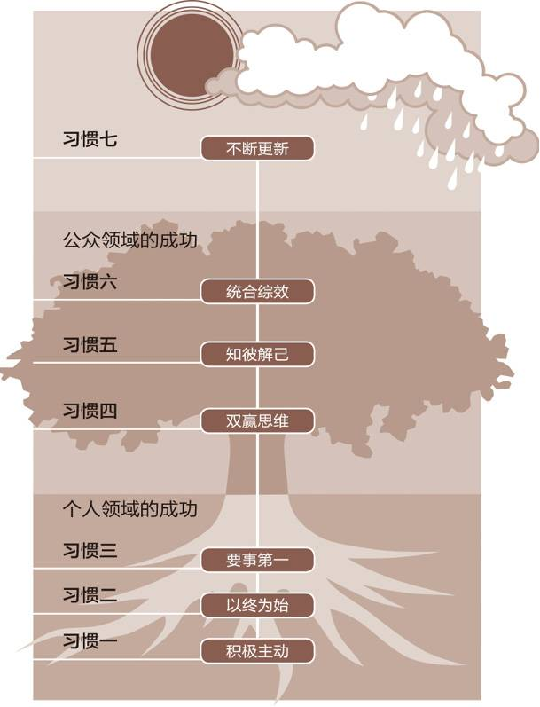
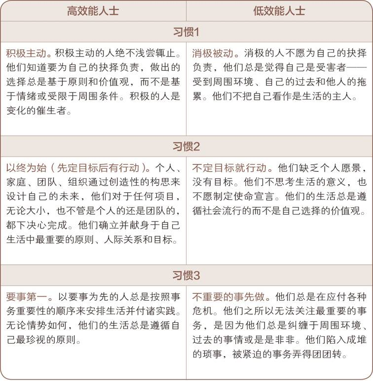
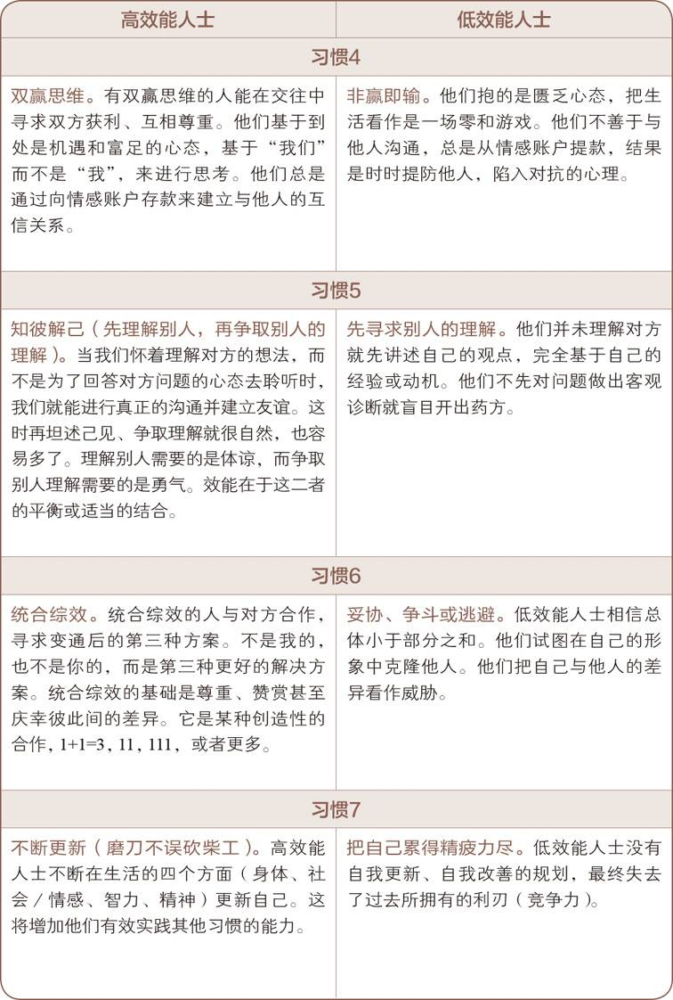

## 七个习惯概论

习惯就像万有引力一样。他让我们的生活保持稳定，同样也给我们制造了障碍。

摆脱习惯就像飞船离开地球一样，刚开始升空需要耗费巨大的能量。

## “习惯”的定义

## 成熟模式图

Maturity Continuum.

Dependence.  依赖期（以你为中心，你必须照顾我）。小时候我们需要依靠父母才能存活。

Independence. 独立期（以我为中心，我可以做到，我可以负责，我可以独立，我可以承担责任）。我们成人后出来工作，独立自主。

Interdependence. 互赖期（以我们为核心，我们可以做到，我们可以合作）。后来我们发现人离不开社会，需要跟公司团队其他人合作。

独立，确实相对比依赖来说是更高层次的成就，但是却不是最高层次的，最高层次是互赖。

有些励志书籍过分强调个体的独立，但却忽视了最基本的一个社会规则，那就是人是群居动物都是需要互赖的，人际沟通和团队精神是很重要的。那些书籍其实上是对依赖的矫枉过正。

有些人会把依赖和互赖混为一谈，实际上可能是为了逃避自己的社会责任。在生活中我们会见到一些抛妻弃子的人，却在表面上声称要自由独立。

作者提及的前三个习惯中，为让我们摆脱依赖，走向独立，属于个人领域的成功，后4个习惯才属于公众领域的成功。

自然法则：P-PC balance 产出-产能平衡。

故事：一个农夫每天都可以在自己家的鹅拿到一个金蛋，后来他变成了一个贪婪的人。终于有一天，他想要更多的金蛋，于是迫不及待的把那只鹅给杀掉想要取出更多的金蛋。最终鹅死了，金蛋也没有了。

金蛋对应产出。鹅一天生产一只金蛋对应产能。

## “效能”的定义

效能是指产出和产能的平衡。

## 三类资产

一个人大概拥有这三类资产：物质资产，金融资本，人力资本。

**物质资产**。作者举例，他买了一个割草机，这个割草，但是疏于维护，割草机用了6个月之后就坏了。

**金融资本**。比如我们存在银行里面的本金，有些人为了改善生活吃掉本金。那么产生的利息就会变少。本金就是产能，利息就是产出。

**人力资本**。夫妻双方的产出就是感情，亲密关系。效能就是使双方增进感情的一些动作，比如体贴，关心照顾等。如果只是一昧索求，操纵控制对方，那么效能降低了，它的产能必然下降，到最后夫妻双方的感情就会日渐退散。

父母控制或者溺爱孩子实际急于想要提高产出（比如好的成绩，打扫房间等），却忽视了产能（即孩子的责任心，自律能力和自信心）

## 团体的产能

## 成长和改变的原则

个人魅力论的缺陷带来一个无可避免的问题：他们更在意别人眼中的自己，而不是真正自己；他们更在意别人看待自己的目光，而忽视自己的幸福。丧失自己的天性和个性。

成长是一个循序渐进的过程。

如果学生不肯发问，不肯暴露自己的无知那么老师，就没办法知道他的真实水平，那么这个学生就很难去长进。

聆听需要耐心、坦诚和理解对方的愿望，属于品德的高级范畴。相比之下，以低投入的情感给出“高高在上”的建议要容易得多。

## 七个习惯简要概括

习惯一：积极主动(BE PROACTIVE)

习惯二：以终为始(BEGIN WITH THE END IN MIND)

习惯三：要事第一(PUT FIRST THINGS FIRST)

习惯四：双赢思维(THINK WIN-WIN

习惯五：知彼解己(SEEK FIRST TO UNDERSTAND,THEN TO BE UNDERSTOOD)

习惯六：统合综效(SYNERGIZE)

习惯七：不断更新(SHARPEN THE SAW)

## 低效能人士的七个习惯

习惯一：消极被动

把所有矛头和问题都指向别人，即受害者心理。

习惯二：漫无目的

没有计划，漫无目的，及时行乐，玩世不恭。

习惯三：要事最后

拖延，总是做紧急的事情，手机消息一来就马上回复。

习惯四：你输我赢思维

习惯五：先谈论，再倾听

习惯六：成为一座孤岛

我自己干就好了。

习惯七：耗尽一切

一直开车不加油。一直工作不运动。一直玩乐不学习。

