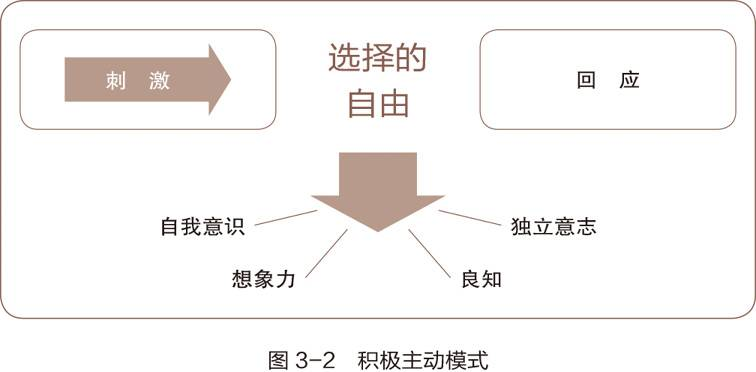
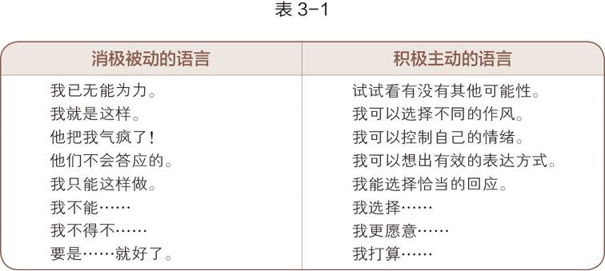
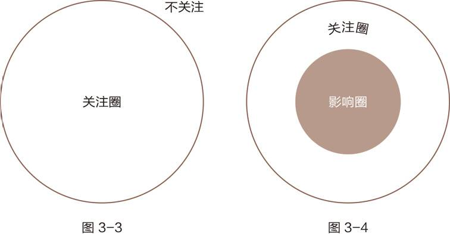
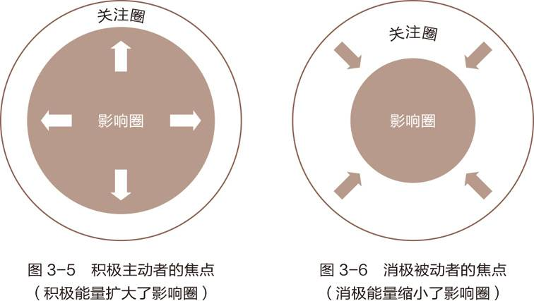

积极主动不仅是说做事情的态度，还有我们要对自己的人生负责。

目前主流的三种人性决定论：

1. 基因决定论。

2. 心理决定论。一个人的性格是由父母的言行所决定的。

3. 环境决定论。

这三种有一个共性：

维克多·弗兰克尔被关进纳粹集中营，他的父母，妻子和兄弟都死于纳粹之手，只剩下一个妹妹，他自己也饱受欺凌折磨。有一天他在小小的囚室里面获得觉悟。纳粹可以控制他的身体，但是他的自我意识是独立的，他有选择回应自己遭遇的自由。后来他不断培育自己的自由心灵的种子，比如通过想象自己离开集中营之后给孩子们讲述他的遭遇，讲述他的宝贵。他通过这种力量感化了自己的狱友，甚至狱卒。

> 出生于奥地利，20世纪美国神经与精神病学教授维克多·弗兰克尔的感人事迹可以帮助我们回答上述疑问。

弗兰克尔是一位深受弗洛伊德心理学影响的决定论者。该学派认为一个人的幼年经历会造就他的品德和性格，进而决定他的一生。

身为犹太人，弗兰克尔曾在“二战”期间被关进纳粹德国的死亡集中营，其父母、妻子与兄弟都死于纳粹魔掌，只剩下一个妹妹。他本人也饱受凌辱，历尽酷刑，过着朝不保夕的生活。

**有一天，他赤身独处于狭小的囚室，忽然有一种全新的感受，后来他称之为“人类终极的自由”。**虽然纳粹能控制他的生存环境，摧残他的肉体，但他的自我意识却是独立的，能够超脱肉体的束缚，以旁观者的身份审视自己的遭遇。他可以决定外界刺激对自己的影响程度，或者说，在遭遇（刺激）与对遭遇的回应之间，他有选择回应方式的自由或能力。

这期间他设想了各式各样的状况，比如想象他从死亡营获释后，站在讲台上给学生讲授自己从这段痛苦遭遇中学得的宝贵教训，告诉他们如何用心灵的眼睛看待自己的经历。

凭着想象与记忆，他不断修行心灵、头脑和道德的自律能力，将内心的自由种子培育得日益成熟，直到超脱纳粹的禁锢。对于物质环境，纳粹享有决定权和一定的自由，但是弗兰克尔享有更伟大的自由——他强大的内心力量可以帮助他实践自己的选择，超越纳粹的禁锢。这种力量感化了其他的囚犯，甚至狱卒，帮助狱友们在苦难中找到生命的意义，寻回自尊。

在最恶劣的环境中，弗兰克尔运用人类独有的自我意识，发掘了人性最根本的原则，即在刺激与回应之间，人有选择的自由。

消极被动的人很容易受环境影响。天气好就开心，天气差就难过。

**我们本可以选择自由，但很多时候我们都默默选择了痛苦。**

人生价值观：

1. 经验价值观。自身经验。

2. 创造价值观。个人独创。

3. 态度价值观。面临困境时的回应。

消极的人言语中会有推卸责任的意图。

经常推卸责任的后果是强化宿命论，一遍一遍的 pua 自己，妄自菲薄，自怨自艾，怪罪别人的环境，甚至涉及到星座。

典型：“这都是命啊”

## 关注圈和影响圈

由内而外的改变。先改变自己的行为，再积极的去影响他人和社会：修身齐家治国平天下。

人类的本能是伪装成受害者，把自己的问题推卸到外界环境、父母、配偶、上司、他人。

其实，我们不是受害者，我们是生活的主导者。

固定型思维。他们认为才智和天赋是一成不变的。

成长型思维。他们认为通过付出和勤奋。可以得到这些基础的能力。

## 付诸行动

