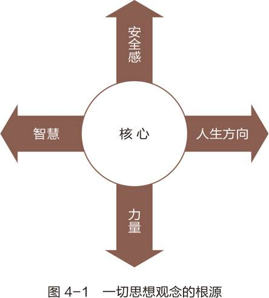
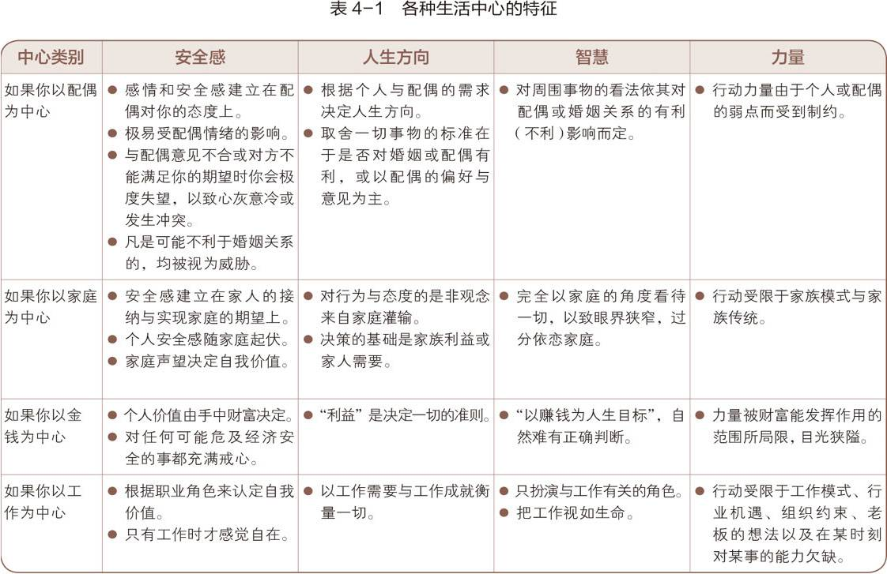
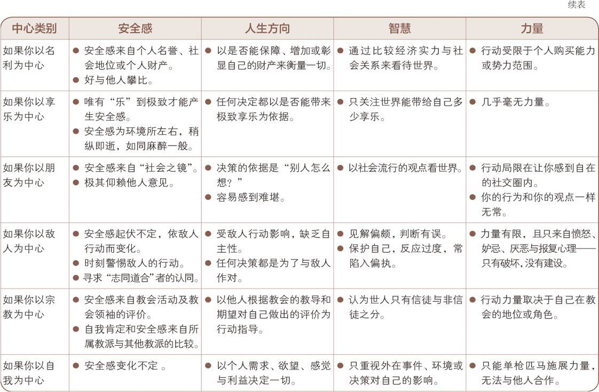
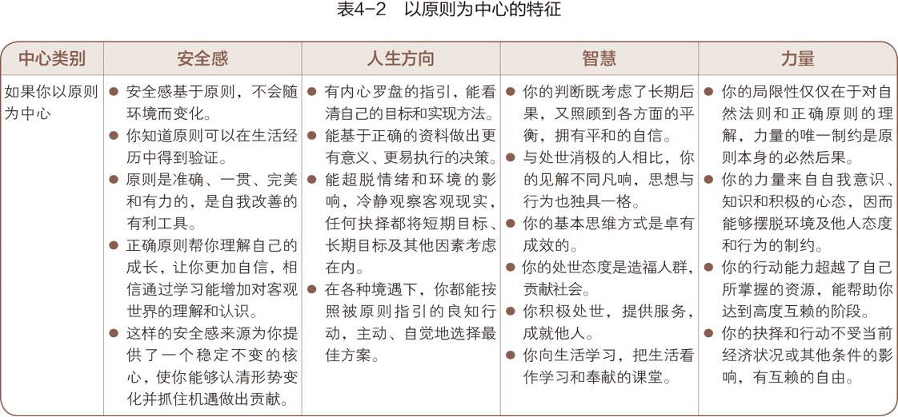
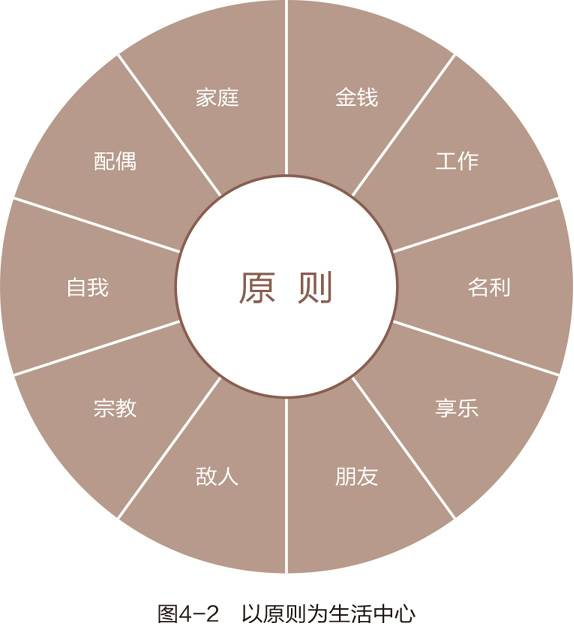

以终为始：将你的人生目标作为衡量一切的标准，行为应该要符合人生目标。

忙碌的人未必有好的结果，埋头苦干，不去反思，爬上通往成功的梯子却发现搭错了墙。明确好目标很重要。

很多功成名就的人，得到名利之后变得空虚。

葬礼上有人问死者的朋友：“他留下了多少遗产？”对方回答：“他什么也没带走。”

## 任何事物都有两次创造

基础客观原则：**任何事物都有两次创造**

1. Metal/First Creation： 智力创造，脑中先构思一遍

2. Physical/Second Creation：物理创造，身体力行地创建出来

## 主动设计还是被动接受

First Creative 不一定是有意识的。有些人意识薄弱，被家庭、同事、朋友压力所推动，缩小自己的影响圈。这些人可能因为早年经历、教育背景、外界环境制约而造成的内心脆弱、依赖心里过重、渴望被接纳和获得归属感，也就是希望**需要别人来获取价值**。

通过自我意识、良知和想象力，我们可以把控自己的第一次创造。所以习惯一谈的是“你是创造者”，习惯二谈的是“第一次创造”。

## 领导与管理

领导和管理的区别。领导是思想，掌握大方向，管理是行为，具体的行动。领导是先于管理的。

“管理是正确地做事，而领导是做正确的事情”——彼得·德鲁克(Peter Drucker)和华伦·贝尼斯(Warren Bennis)

任何企业，任何时候，领导都是重要于管理的。

“我相信为人父母者也难免会走入类似的管理误区，只想到规矩、效率与控制，忽略了目的、方向与亲情。”

个人领导的意识更加匮乏，连自己的价值观都不清楚，就想着提高效率、制定目标和完成任务。

## 改写人生剧本：成为自己的第一次创造者

已故埃及总统萨达特(Anwar Sadat)，在仇恨以色列的环境中长大，政治家们一度以仇恨以色列来调用民族情绪，年轻的萨达特因为推翻国王法鲁克而被关进监狱。在监狱中，萨达特理清情绪，重新认识自己，自创冥想体系，用圣经和祷告改写剧本。出狱后，他仍积极参与革命，最后主张和平的方式解决中东问题，并积极推动和以色列的和平谈判。

“萨达特说他甚至都不愿离开监狱，因为他在那里学会了真正的成功是战胜自我。成功不是获取财富，不是掌握权力，而是赢得与自己的较量。”

各种生活中心对四个方向带来的问题。

以原则为中心。

实际问题：本来你和伴侣约定好今晚去约会，但是下午四点老板电话给你让你加班，因为明早有个重要的会议，怎么办？

小技巧，想象自己只有为数不多的生命，辱骂、争吵、名利变得渺小，原则、价值观变得无比清晰。

**100% 坚定原则比 98% 坚定原则更简单。**

定义自己的个人宪法：[https://msb.franklincovey.com/](https://msb.franklincovey.com/)

