管理和领导是不一样的。

左脑所擅长的能力：分解、分析、排序，具体运用以及在规定时间内完成任务等。

提高效能的方法：左脑进行管理，右脑进行领导。

## 独立意志：有效管理的先决条件

除了自我意识、想象力和良知之外，想要真正实现成功的自我管理，就必须发挥人类的第四大天赋——独立意志。

独立意志无法产生即时成功，也不是一次性成功，我们要做的是，把独立意志运用在每一个决策中。

## 四代时间管理理论的演进

时间管理的精髓：如何分辨轻重缓急和培养组织

能力

四代时间管理发展理论

第一代：着重利用便条与备忘录，在忙碌中调配时间与精力。

第二代：强调行事历与日程表，反映出时间管理已注意到规划未来的重要。

第三代：目前正流行、讲求优先顺序的观念。也就是依据轻重缓急设定短、中、长期目标，再逐日订立实现目标的计划，将有限的时间、精力加以分配，争取最高的效率。

第四代：否定“时间管理”，关键不在于时间管理，而是着重于个人管理，把重心放在维持产出和产能的平衡上。

## 别让琐事牵着鼻子走

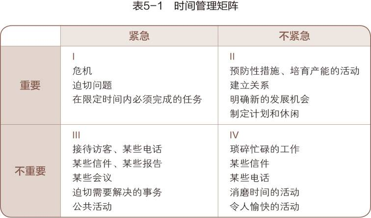

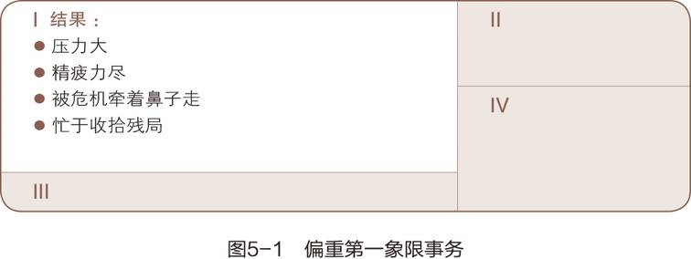

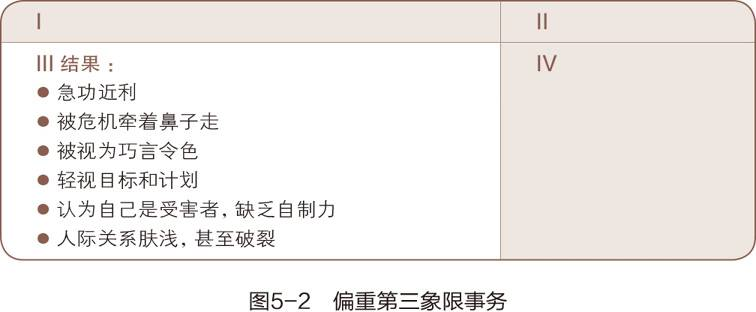

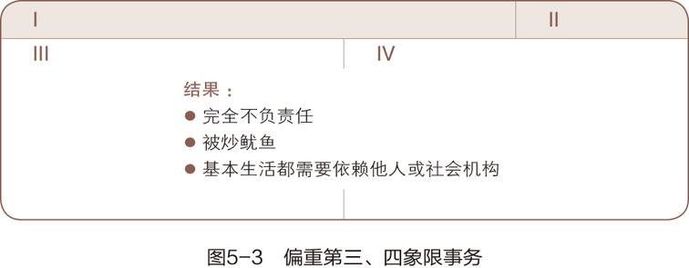

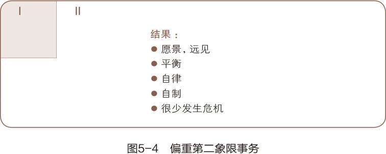

第二象限的事情有个特点：重要，能改变我们的生活，但不紧急，常常被我们忽略。

我们应该聚焦在第二象限上，着重处理重要但不紧急的事情，因为它能提高我们的效能：提高效能肯定是处理重要的事情，也就是第一象限和第二象限；对于第一象限，所有人都会抓紧处理，所有人效能都提升，也就意味着任何人都没有提升；对于第二象限，不紧急导致很多人的忽略，如果此时你能优先处理，效能就能拉起来。

> 比如，所有人都知道身体很重要，但是又不紧急，所以很多人都在糟践身体

## 勇于说“不”

我的训练课程十分强调分辨轻重缓急以及按部就班行事。我常问受训人员：

你的缺点在于——

无法辨别事情重要与否？

无力或不愿有条不紊地行事？

缺乏坚持以上原则的自制力？

大部分人选择了 3，但作者认为是 1：

> 我认为，那是“确立目标”的功夫还不到家使然。而且不能由衷接受“事有轻重缓急”的观念，自然就容易半途而废。

> 这种人十分普遍。他们能够掌握重点，也有足够的自制力，却不是以原则为生活中心，又缺少个人使命宣言。由于欠缺适当的指引，他们努力休假，努力做到符合原则的态度和行为，但却没有想过去检验一下作为根基的基本思维方式，因而他们带着伪面具，外在表现的也许内心并不认同。

> 以配偶或金钱、朋友、享乐等为中心，容易受第一与第三象限事务羁绊。至于自我中心者难免被情绪冲动所误导，陷溺于能博人好感的第三象限活动，以及可逃避现实的第四象限事务。这些诱惑往往不是独立意志所能克服，只有由至诚的信念与目标出发，才能够产生坚定说“不”的勇气。

建筑学观点：**功能决定外观，你对待时间和要事决定了你怎么利用时间。**

## 第四代时间管理的六个标准

让第二象限成为人生中心

1. 和谐一致：个人的理想与使命、角色与目标、工作重点与计划、欲望与自制之间，应和谐一致

2. 平衡：某方面的成功无法弥补其他方面的损失，成功的事业换不回破碎的婚姻、孱弱的身体或缺失的性格

3. 围绕中心

4. 以人为本

5. 灵活变通

6. 便于携带

## 自我管理四步骤

1. 确认角色

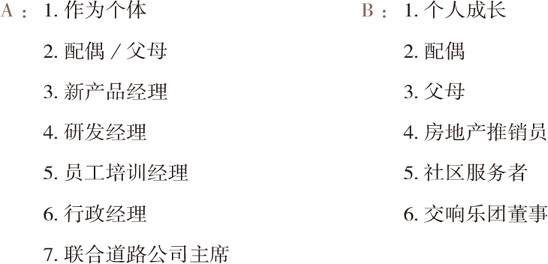

1. 选择目标

1. 安排进度

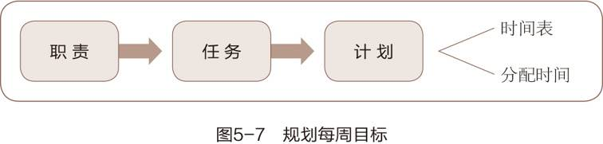

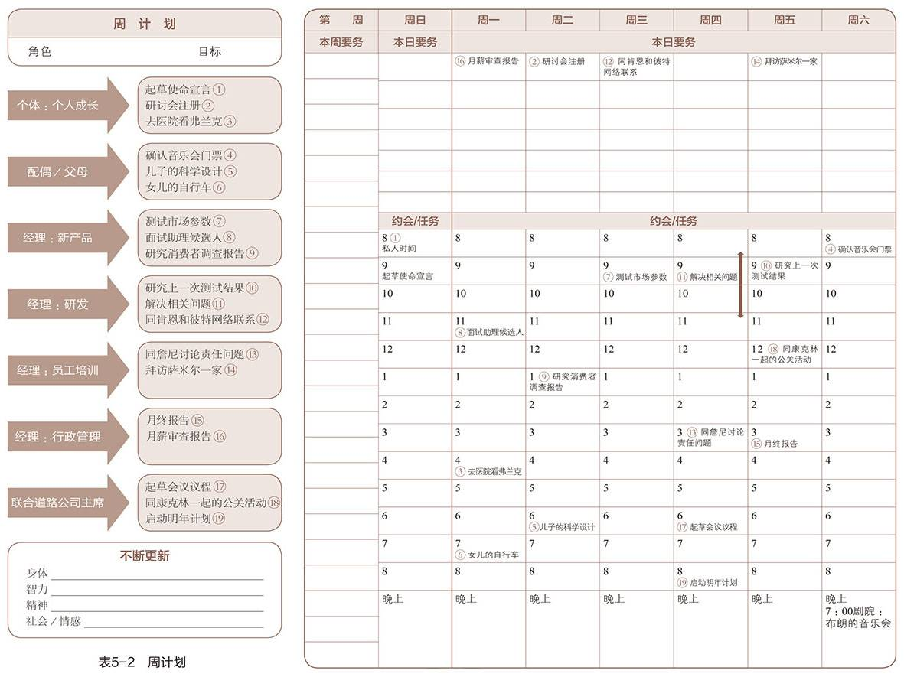

1. 每日调整

## 付诸实践

对事要讲效率，对人要讲效用（即一件行为是否有效）。

1. 两个人都有各种都效率速率，难以同频

2. 伤害感情，降低标准，有效即可

第四代个人管理的进步：**人比事更重要，**以终为始（原则为中心，良知为导向），平衡个人角色

一条主线：人际关系和结果放在第一位，将时间放在第二位

## 授权：高效能的秘诀

把工作授权给其他成熟老练的员工的好处：

- 自己释放出来，去完成更高层次的要事

- 促进个人成长，促进团队成长

事必躬亲者和放手管理者单位时间的产出不一样

- 事必躬亲者 1 单位时间只能产出 1 单位成果

- 管理者 1 单位时间可以产出 50 甚至 100 倍的单位产出

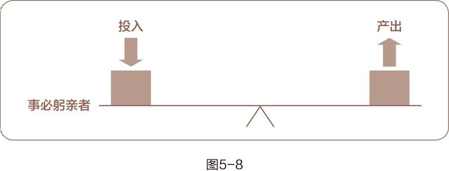

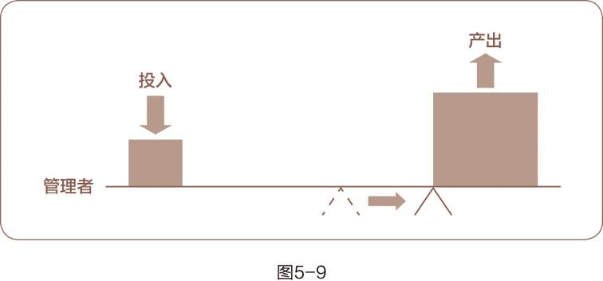

## 指令型授权

关注过程和结果

详细给出每一步的工作方法

## 责任型授权

关注最终的结果

双方应达成共识：

1. 预期结果：已结果为中心

2. 指导方针：避免成为指令型授权，但要有一定的限制性规定，并且可以告知一些潜在风险

3. 可用资源

4. 责任归属

5. 明确奖励

信任是促使人进步的最大动力。

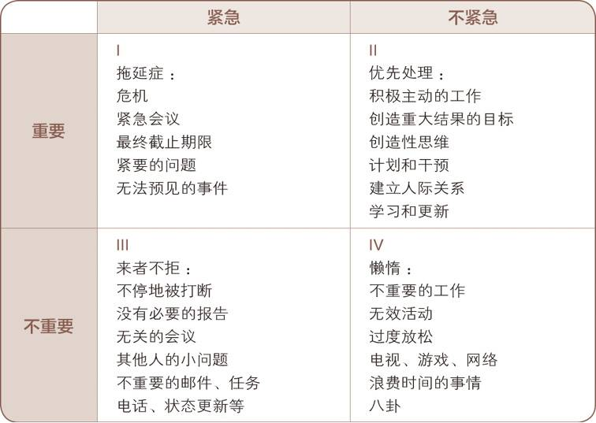

隧道效应：人站在隧道里，只能看见隧道出口的一个小光点，而容易忽视其他

