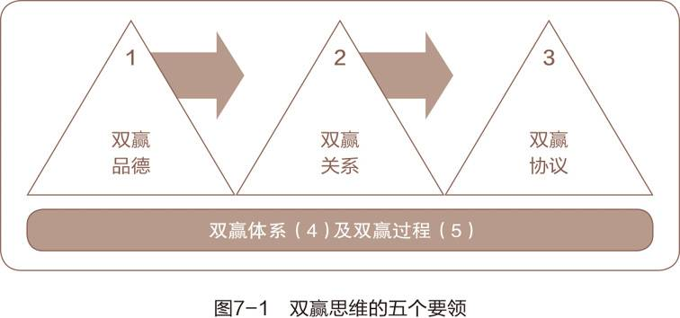
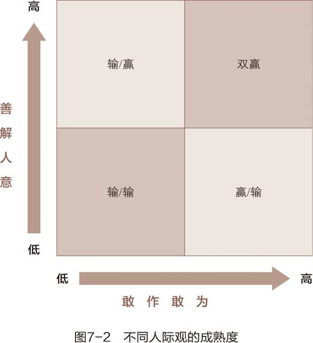

> 双赢者把生活看作一个合作的舞台，而不是一个角斗场。
一般人看事情多非此即彼，非强即弱，非胜即败。
其实世界之大，人人都有足够的立足空间，他人之得不必视为自己之失。

## 人际交往的六种模式

1. 利人利己（-双赢）

2. 两败俱伤（输/输）

3. 损人利己（赢/输）

4. 独善其身（赢）

5. 舍己为人（输/赢）

> “我输了，你赢了”
“就这样吧，听你的”
“我是个和事佬，只要能息事宁人，我做什么都可以”

这种人没有标准，喜欢取悦别人，以获取别人认同为重点而忽略自己的感受

长期输/赢会让人憋屈，致使更大的矛盾 or 引发心理疾病

1. 好聚好散（无-交易）

使用哪种模式视情况而定，但双赢才是唯一通行的

## 做不到双赢就先好聚好散

这一模式意味着宝贵的自由

达不到双赢，只剩输/赢，赢/输，输/输，结果只能是双方较劲，互不妥协，浪费人生。

## 双赢思维的五个要领

## 双赢品德

**诚信**：赢的基础

**成熟** ：善解人意+敢作敢为

> “成熟就是在表达自己的情感和信念的同时又能体谅他人的想法和感受的能力。”这是赫兰德·萨克森年(Hrand Saxenian)教授多年研究得出的结论

**知足**：相信资源充足，人人有份

不知足的人陷入零和游戏的想法，不见不得人好，妒忌他人成就

## 双赢关系

即情感账户

## 双赢协议

双赢协议应该对这 5 要素进行规定：

1. 预期结果

2. 指导方针

3. 可用资源

4. 任务考核

5. 奖惩制度

双赢协议注重的是结果，要释放个人潜力，将协作效应最大化，产出与产能并重。

双赢绩效协议

斯坦福大学的尼尔·哈勒维和L.T.菲利普斯与商学院学生共同开展研究，他们用博弈模型进行超过1.2千万场计算，清楚地表明合作策略产生的利润要远远大于竞争策略。

