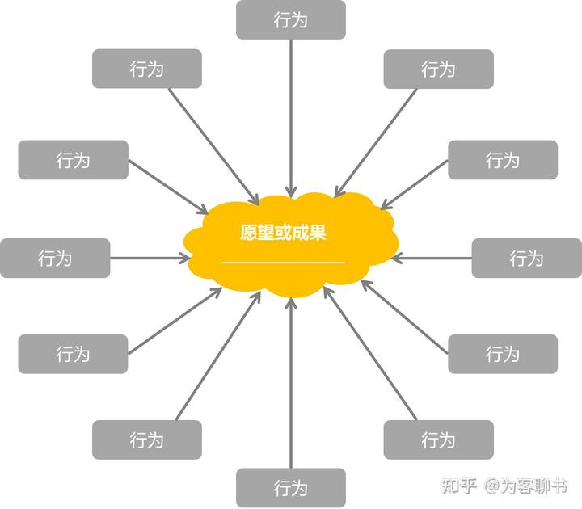
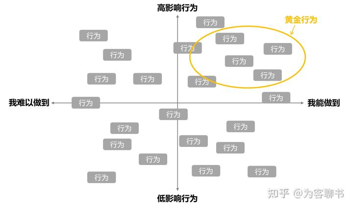
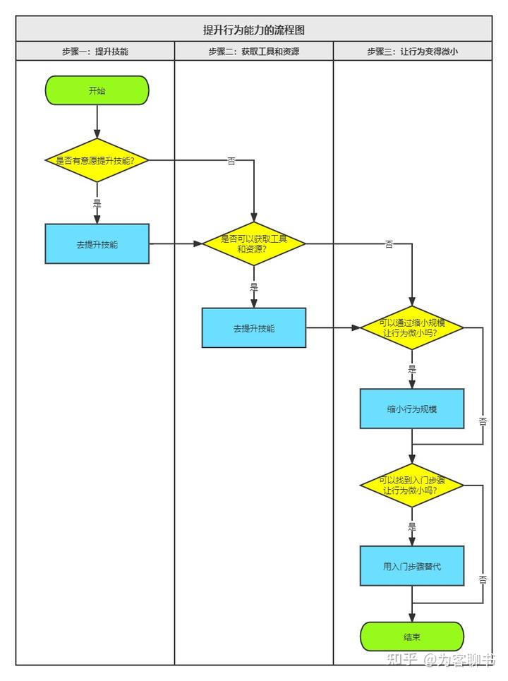
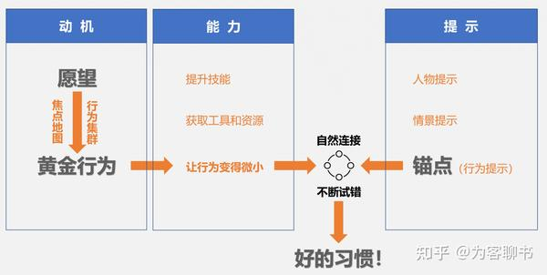
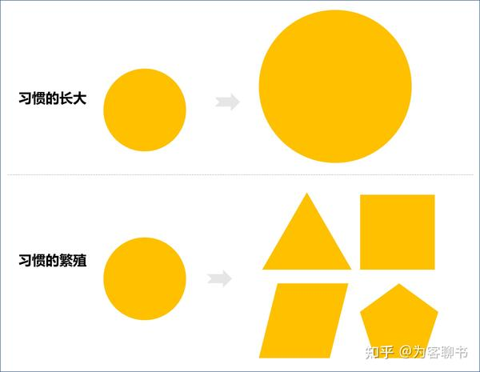
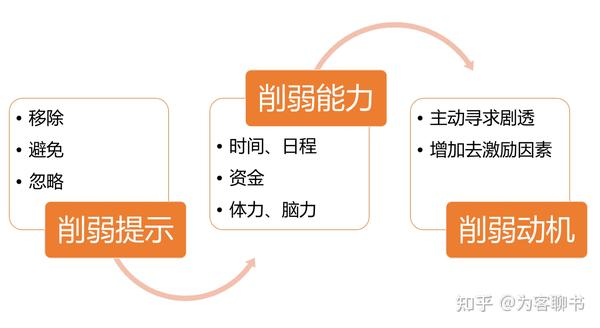

【干货、万字长文】远不止B=MAP：《福格行为模型》到底讲了什么？ - 霹雳爱读书的文章 - 知乎 [https://zhuanlan.zhihu.com/p/462990256](https://zhuanlan.zhihu.com/p/462990256)

光靠动机无法改变行为，动机具有：

- 复杂性（多样性）：由人内心产生的动机，由利益（或惩罚）驱使的动机，由情境引发的动机

- 波动性：三分钟热度

---

非潜意识的动机 → 愿望

---

区分愿望、目标和行为：

- 愿望：抽象，指明方向

- 目标：具体可衡量

- 行为：达成目标的直接手段

---

行为集群：从愿望映射到行为

---

识别黄金行为：

评估能力的五个方面：**时间、资金、体力、脑力和日程**

---

让行为变得容易：

1. 提升技能

2. 获取工具和资源

3. 让行为变得渺小

    4. 入门步骤：去跑步，穿上跑鞋和带钥匙

    5. 缩小规模：每天做五十个俯卧撑，现在做五个

提示分为三种：

1. 人物提示

2. 情境提示

3. 行为提示

---

福格博士提倡用行为作为提示，即将已经形成习惯的行为作为提示（**锚点**），以此来培养新的习惯。

第一步：确定锚点

第二步：用试验将锚点与黄金行为联系起来

第三步：利用“最后动作”优化锚点（比如，“上完厕所”就是一个相对模糊的锚点，而“按下冲洗马桶按钮”就更明确。并且，冲马桶正是上完厕所的最后一个动作）

---

庆祝很重要：行为设计，其本质是情绪设计

福格教授甚至强调说：“**如果你只能从这本书里学到一样东西的话，我希望是：为你的微小成功而庆祝。**即使你觉得自己一时之间还无法摆脱困境，生活中的小小改变也能够产生巨大的影响力。庆祝可以成为你的救生绳。”

---

庆祝的技巧：及时 + 强度

区分两个概念：激励和奖励

- 如果跑完步后马上去做一次按摩，这是奖励

- 而如果连续坚持跑步两周后才进行一次按摩，那叫激励。差异就体现在时间间隔。

当你感受到成功时，就好像自己在**发光（Shine）**。

找到自己庆祝的强度。

另外两点：

- 可以准备不同等级的庆祝方式

- 可以在庆祝中引入一些随机性

**庆祝闪电战，**它的操作方法是这样：

1. 找到家里或办公室里最不整洁的地方。

2. 设定倒计时3分钟。

3. 每完成一项清理工作之后，立刻为自己庆祝。

4. 继续清理和庆祝。

5. 三分钟结束后，停下来，专注于自己的感受。你的情绪发生了什么变化？你学到了什么？

---

从学习《福格行为模型》到现在，通过从动机到能力，再到提示和庆祝的逐步分解，我们已经得到了一套行为设计的基本流程，大致如下：

1. 明确愿望

2. 探索行为选项

3. 为自己匹配具体行为

4. 改造行为，使之微小

5. 找到对的提示

6. 及时庆祝成功

通过这套流程，我们已经可以着手改变，让自己养成更好习惯。

---

习惯会长大和繁殖

习惯分为三种：

1. 上山型：需要努力维持，而且容易半途而废

2. 下山型：容易形成且难以停止，包括吃甜食、骂脏话、玩游戏、刷短视频等

3. 自由落体：例如吸毒、药物滥用等习惯，它们与“成瘾”相关，如果不求助专业人士的帮忙，很难自己停下来

---

改变坏习惯：

---

延伸：[https://mp.weixin.qq.com/s/tdoIg8CeqCuoB4ioAVEg5A](https://mp.weixin.qq.com/s/tdoIg8CeqCuoB4ioAVEg5A)

Hagger 等人（2010）在一次元分析中发现，引起意志力损耗的 5 个重要因素是：努力程度、感知难度、消极情绪、主观疲劳和血糖水平。

「感知难度」这个因素经常被我们忽视，大家总以为，定个令人兴奋的大目标就会斗志满满地前进，**实际上却是，大脑一旦感知到这件事儿难度很大，一步都还没行动呢，意志力就已经损耗了。**

