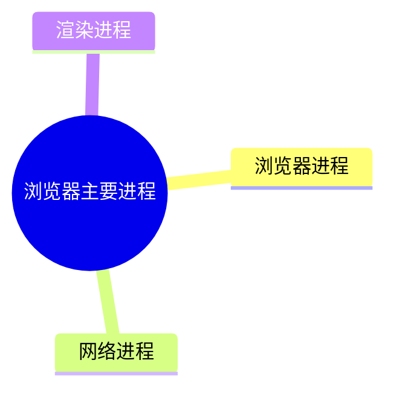

## 浏览器有哪些进程和线程

浏览器主要进程：



> 可以在浏览器的 Task Manager（任务管理器）中查看当前的所有进程:
>
> 

1. 浏览器进程：负责界面显示、用户交互、子进程管理等。浏览器进程内部会启动多个线程处理不同的任务。
   1. 界面交互：指的是像搜索框、前进后退按钮这些界面。
   2. 用户交互：指浏览器窗口点击、鼠标滚动、键盘按键这类用户交互。
   3. 子进程管理：指其他网络进程、渲染进程等管理。
2. 网络进程：负责加载网络资源。网络进程内部会启动多个来处理不同的网络任务。
3. **渲染进程**：渲染进程启动后，会开启一个**渲染主线程**，渲染主线程主要负责执行 HTML、CSS、JS 代码。默认情况下，一个标签页对应一个渲染进程，保证不同标签页之间不相互影响（Process-per-tab）。

> 其他情况：
>
> 1. 多个 Tab 访问相同站点（Process-per-site）：
>
> 
>
> 从 Task Manager 可以看到，两个访问相同地址的 Tab 都是属于 `56450` 进程。
>
> 2. 单个标签页有不同站点的 iframe：
>
> 
>
> 从 Task Manager 来看，iframe 会启动一个叫做 Subframe 的 `56213` 独立进程。
>
> 更多查看谷歌文档：[Process Model and Site Isolation](https://chromium.googlesource.com/chromium/src/+/main/docs/process_model_and_site_isolation.md#Modes-and-Availabiility)

## 渲染主线程

渲染主线程是最繁忙的线程：

* 解析 HTML
* 解析 CSS
* 计算样式
* 布局
* 处理图层
* 每秒把页面画 60 次
* 运行 JavaScript 代码
* 执行事件处理函数
* 执行定时器的回调函数
* ……

> 思考题：为什么渲染进程不适用于多个线程来处理这些事情？
>
> The browser’s main thread manages numerous tasks, including executing JavaScript, handling user interactions, and updating the DOM. This design primarily stems from **the single-threaded nature of JavaScript** and the complexity of ensuring thread safety within the **Document Object Model (DOM)**. 
>
> 
>
> **Single-Threaded Nature of JavaScript**: JavaScript was designed as a single-threaded language to avoid issues like race conditions and deadlocks, which can arise in multi-threaded environments. This simplifies development and ensures predictable execution of code.
>
> 
>
> **Thread Safety and the DOM**: The DOM represents the structure of a web page and is not inherently thread-safe. Implementing multi-threaded access to the DOM would require complex synchronization mechanisms, such as multiple locks and mutexes, to prevent conflicts when multiple threads attempt to read or modify the DOM simultaneously. This added complexity could lead to performance bottlenecks and increased potential for bugs. 
>
> 
>
> **Asynchronous Operations and the Event Loop**: To manage tasks efficiently without blocking the main thread, JavaScript utilizes an event loop along with task and microtask queues. This architecture allows asynchronous operations, like handling user inputs or fetching data, to be processed in a non-blocking manner, maintaining responsiveness despite the single-threaded execution model. 
>
> 
>
> **Leveraging Web Workers for Parallelism**: For tasks that are computationally intensive and can operate independently of the DOM, developers can use Web Workers. Web Workers run scripts in background threads, enabling parallel execution and reducing the load on the main thread. However, they operate in isolated contexts without direct access to the DOM, which limits their applicability to certain tasks. 
>
> 
>
> In summary, while the main thread handles numerous responsibilities to maintain simplicity and predictability in web development, mechanisms like the event loop and Web Workers provide avenues to manage performance and responsiveness effectively within the constraints of JavaScript’s single-threaded nature.


渲染主线程如此忙碌，如何正确地调度任务？

比如：

- 我正在执行一个 JS 函数，执行到一半的时候用户点击了按钮，我该立即去执行点击事件的处理函数吗？

- 我正在执行一个 JS 函数，执行到一半的时候某个计时器到达了时间，我该立即去执行它的回调吗？

- 浏览器进程通知我“用户点击了按钮”，与此同时，某个计时器也到达了时间，我应该处理哪一个呢？

- ###### ……


渲染主线程使用「排队」来处理：


事件循环过程：

1. 最开始，渲染主线程会进入一个无限循环（`for(;;)`）
2. 每一次渲染主线程进入循环，会从消息队列中取任务执行，执行完毕之后进入下一轮循环；没有任务则进入休眠状态；
3. 其他线程随时可以向消息队列末尾插入任务，如果渲染主线程在休眠，则唤醒它

## 若干解释

### 何为异步

无法立即执行完成的任务：

1. 定时器回调任务：`setTimeout`，`setInterval`
2. 网络通信回调任务：`XHR`、`fetch`
3. 用户事件回调任务：`addEventListener`

如果让渲染主线程等待这些任务，那么会导致主线程长时间造成**阻塞**，从而导致浏览器卡死。

同步方式：


异步方式：


> 面试题:如何理解JS的异步?
>
> 参考答案:
>
> JS 是一门**单线程**的语言，这是因为它运行在浏览器的**渲染主线程**中，而渲染主线程只有一个。而渲染主线程承担着诸多的工作，渲染页面、执行 JS 都在其中运行。
>
> 如果**使用同步**的方式，就极有可能导致主线程产生阻塞，从而导致消息队列中的很多其他任务无法得到执行。这样一来，一方面会导致繁忙的主线程白白的消耗时间，另一方面导致页面无法及时更新，给用户造成卡死现象。
>
> 所以浏览器采用**异步**的方式来避免。具体做法是当某些任务发生时，比如计时器、网络、事件监听，主线程将任务交给其他线程去处理，自身立即结束任务的执行，转而执行后续代码。当其他线程完成时，将事先传递的回调函数包装成任务，加入到消息队列的末尾排队，等待主线程调度执行。
>
> 在这种异步模式下，浏览器永不阻塞，从而最大限度的保证了单线程的流畅运行。

### JS 为何会阻塞渲染

猜猜下面这段代码的表现，是先绘制再阻塞 3s，还是阻塞 3s 后再绘制？

```html
<button>Click Me</button>
<div>
  <p>Hello World</p>
</div>
<script>
  const button = document.querySelector('button');

  function delay(ms) {
    const currentTime = new Date();
    while (new Date() - currentTime < ms) {
      // Do nothing
    }
  }

  button.addEventListener('click', () => {
    const div = document.querySelector('div');
    div.style.backgroundColor = 'red';
    delay(3000);
  });
</script>
```

答案是阻塞三秒后绘制。

用事件循环解释，渲染主线程执行完整个代码，会把 click 点击事件回调交给「交互线程」，然后进入休眠状态。当用户点击按钮后，交互线程会把回调任务塞进消息队列中，同时唤醒渲染主线程执行。 `div.style.backgroundColor = 'red';` 生成新的绘制任务塞进消息队列中，此时绘制任务还没执行，继续执行阻塞 3s。


### 任务有优先级吗？

同一消息队列中的任务是没有优先级的， first in first out，但不同消息队列是有优先级的。


根据 W3C 的最新解释：

- 每个任务都有一个任务类型，同一类型的任务必须在一个队列，不同类型的任务可以分属于不同的队列。在一次事件循环中，浏览器可以根据实际情况从不同的队列中取出任务执行。
- 浏览器必须准备好一个微队列，微队列中的任务优先与所有其他任务执行。

https://html.spec.whatwg.org/multipage/webappapis.html#perform-a-microtask-checkpoint


> 随着浏览器的复杂程度提升，W3C 不再使用「宏队列」的说法。


在目前 Chrome 的实现中，至少包含了下面的队列：

- 延时队列：用于存放计时器到达后的回调任务，优先级「中」
- 交互队列：用于存放用户操作后产生的事件处理任务，优先级「高」
- 微队列：用户存放需要最快执行的任务，优先级「最高」

> 浏览器还有其他队列，对于和平时开发关系不大，暂不介绍


添加任务到微队列的主要方式有：`Promise` 和 `MutationObserver`

比如 

```javascript
// 立即把一个函数添加到微队列中
Promise.resolve().then(console.log)
```


> 面试题:阐述一下JS的事件循环
>
> 参考答案:
>
> 事件循环又叫做消息循环，是浏览器渲染主线程的工作方式。
>
> 在 Chrome 的源码中，它开启一个**不会结束的 for 循环**，每次循环从消息队列中取出第一个任务执行，而其他线程只需要在合适的时候将任务加入到队列末尾即可。
>
> 过去把消息队列简单分为宏队列和微队列，这种说法目前已无法满足复杂的浏览器环境，取而代之的是一种更加灵活多变的处理方式。
>
> 根据 W3C 官方的解释，**每个任务有不同的类型，同类型的任务必须在同一个队列，不同的任务可以属于不同的队列**。不同任务队列有不同的优先级，在一次事件循环中，由浏览器自行决定取哪一个队列的任务。但浏览器必须有一个微队列，微队列的任务一定具有最高的优先级，必须优先调度执行。


> 交互队列会优先于延时队列，看下面例子：
>
> ```html
> <!DOCTYPE html>
> <html lang="en">
> <head>
>   <meta charset="UTF-8">
>   <meta name="viewport" content="width=device-width, initial-scale=1.0">
>   <title>Document</title>
> </head>
> <body>
>   <button id="start">Start</button>
>   <button id="interaction">Interaction</button>
>   <script>
>     function delay(ms) {
>       const startTime = new Date();
>       while (new Date() - startTime < ms) {
>         // Do nothing
>       }
>     }
> 
>     const startButton = document.getElementById('start');
>     const interactionButton = document.getElementById('interaction');
> 
>     function addDelay() {
>       console.log('添加到延时队列')
>       setTimeout(() => {
>         console.log('延时队列执行')
>       }, 100)
>       delay(2000)
>     }
> 
>     function addInteraction() {
>       console.log('添加到交互队列')
>       interaction.onclick = () => {
>         console.log('交互队列执行')
>       };
>       delay(2000)
>     }
> 
>     startButton.onclick = function () {
>       addDelay()
>       addInteraction()
>       console.log('=============')
>     }
> 
>   </script>
> </body>
> </html>
> ```


> 面试题:JS中的计时器能做到精确计时吗?为什么?
> 不行,因为:
>
> 1. 计算机硬件没有原子钟，无法做到精确计时
>
> 2. 操作系统的计时函数本身就有少量偏差，由于 JS 的计时器最终调用的是操作系统的函故,也就携带了这些偏差
> 3. 按照 W3C 的标准，浏览器实现计时器时，如果嵌套层级超过 5 层,则会带有 4 毫秒的最少时间，这样在计时时间少于 4 毫秒时又带来了偏差
> 4. 受**事件循环**的影响，计时器的回调函数只能在主线程空闲时运行，因此又带来了偏差


“单线程是异步产生的原因，事件循环是异步的实现方式。”


